# FJSP-RL-ALNS-Scheduling

## GA–RL–ALNS–TS 混合优化算法求解柔性作业车间调度问题

<p align="center">
  
  
  
  
  
  
</p>

> **摘要**：柔性作业车间调度问题（Flexible Job-Shop Scheduling Problem, FJSP）是经典作业车间调度问题的重要扩展，允许每道工序在多个可选机器上加工，在显著提升生产灵活性的同时极大增加了问题的求解复杂度。本文提出一种融合遗传算法（GA）、Q-学习强化学习（RL）、自适应大邻域搜索（ALNS）与禁忌搜索（TS）的四阶段混合优化框架，并集成滚动时域控制（RHC）机制以应对动态扰动环境。算法在 Brandimarte Mk（9 例）、Barnes（21 例）、Dauzère（8 例）以及 Hurink 三组变体（car/ft/orb × edata/rdata/vdata，共 63 例）四大标准算例家族合计 101 个基准实例上进行了系统验证，覆盖从 6×5 至 20×15 多种规模的调度场景。实验结果表明，所提混合算法在求解质量和收敛稳定性方面均表现出竞争力。此外，本文还设计了包含分段持久化、断点续跑等特性的全量实验框架，为大规模 FJSP 算法对比研究提供了可复现的实验平台。

> **关键词**：柔性作业车间调度；遗传算法；Q-学习；自适应大邻域搜索；禁忌搜索；滚动时域优化；混合优化算法

---

## 📖 1 研究背景

作业车间调度问题（Job-Shop Scheduling Problem, JSP）是生产调度领域中最具代表性的组合优化问题之一，已被证明为 NP-hard 问题 [1]。柔性作业车间调度问题（Flexible Job-Shop Scheduling Problem, FJSP）作为 JSP 的泛化形式，取消了"每道工序只能在唯一专用机器上加工"的约束，允许每道工序从一组功能等效的候选机器中选择一台进行加工。这一柔性特征更贴合现代制造业中多品种、小批量、设备通用化的实际生产场景，但也使问题求解难度大幅上升——FJSP 在工序排序决策的基础上增加了机器分配决策，构成了一个兼具排序与分配双重耦合特性的复杂组合优化问题 [2]。

现有 FJSP 求解方法可归纳为精确算法（如分支定界法 [3]）、启发式算法（如优先分配规则 [4]）和元启发式算法三大类。其中，元启发式算法因其在求解质量与计算效率之间的良好平衡而受到广泛关注。遗传算法（GA）具有较强的全局搜索能力，但在局部精搜方面存在天然的不足；禁忌搜索（TS）虽擅长局部邻域挖掘，却易陷入初始解依赖的困境。此外，多数现有方法在静态假设下设计，难以直接应对加工时间波动、设备退化及紧急插单等动态车间场景 [5]。

针对上述问题，本文提出一种四阶段混合优化框架——GA–RL–ALNS–TS，其设计思路为：以 GA 作为全局探索引擎，利用 Q-学习控制器动态调控 GA 的交叉与变异概率，实现搜索过程的自主调节；对 GA 产出的优质个体，进一步通过 ALNS 执行多算子邻域增强和 TS 执行关键路径的局部精搜，形成多层次递进式优化链条。同时，引入滚动时域控制（RHC）机制，将静态离线优化的求解能力扩展至动态在线调度场景。

本文的贡献可归纳为以下四点：

1. **🧬 四阶段混合架构**：构建了 GA → RL → ALNS → TS 的递进式求解框架，各算法协同工作、优势互补。
2. **🎯 强化学习自适应参数调控**：将 Q-学习嵌入 GA 迭代过程，基于种群收敛状态与多样性特征实时调整交叉与变异概率，实现搜索行为自主适配。
3. **🔄 滚动时域动态调度**：支持事件驱动、周期驱动及混合驱动三种触发模式，模拟设备退化、加工时间波动、紧急插单等真实车间扰动。
4. **📊 系统化实验验证**：在 101 个标准基准算例上完成了全面评估，并构建了支持断点续跑的可复现实验管道。

---

## 📐 2 问题定义

### 2.1 柔性作业车间调度问题

FJSP 可形式化描述如下：给定一个由 n 个工件（Job）组成的集合和由 m 台机器组成的集合。每个工件包含若干道具有先后约束的工序（Operation）。每道工序可在其候选机器集合中的任意一台机器上加工，且在不同机器上的加工时间可能不同。

FJSP 的求解目标是为每道工序选择一台合适的机器并确定所有工序在机器上的加工顺序，以优化一个或多个调度性能指标。本文以**最大完工时间（Makespan）**为优化目标，同时关注机器负荷均衡性。

### 2.2 数学模型

定义 0-1 决策变量：x_{ijk} 表示工序 O_{ij} 是否分配至机器 M_k 加工；y_{ij}^{i'j'} 表示工序 O_{ij} 是否先于 O_{i'j'} 加工。令 s_{ij} 为工序开始时间，c_{ij} 为完成时间。

优化目标为最小化最大完工时间（Makespan）。约束条件包括：(1) **工序先后约束**——同一工件的工序须按顺序依次加工；(2) **机器唯一性约束**——同一时刻一台机器只能加工一道工序；(3) **机器选择约束**——每道工序必须分配且仅分配一台机器。

此外，本文在滚动时域模式下还引入了设备退化与加工时间波动模型，将静态优化扩展至动态场景。

---

## ⚙️ 3 算法设计

### 3.1 总体框架

本文提出的 GA–RL–ALNS–TS 混合算法采用四层递进式结构，各层的功能定位如下：

1. **GA 全局探索层**：通过 OS（Operation Sequence, 工序顺序）与 MS（Machine Selection, 机器选择）双编码方案，利用进化操作在大范围解空间中搜索优质区域。
2. **RL 参数调控层**：Q-学习控制器实时监测种群收敛度与多样性，动态调整 GA 的交叉概率与变异概率，在探索与利用之间实现自适应平衡。
3. **ALNS 邻域增强层**：针对 GA 产出的精英个体，采用多种破坏/修复算子的自适应竞争机制进行深度邻域搜索。
4. **TS 局部精搜层**：参考 HA-FJSP [6] 的 TS1 与 TS2 邻域结构，对关键路径工序执行机器重分配与工序交换的精搜索。

RHC 控制器位于混合算法之上，负责在动态场景中调度执行窗口、检测触发条件并协调下层优化引擎的重调度过程。

### 3.2 遗传算法（GA）

#### 3.2.1 编码与解码

采用 OS–MS 双编码方案。OS 部分为工件编号序列，每个工件出现的次数等于其工序数；MS 部分为整数序列，每个元素表示对应工序在候选机器集合中的选择索引。

解码时，按照 OS 序列的顺序，依次确定每道工序的加工机器（由 MS 编码指定），并基于工序先后约束与机器可用时间计算各工序的开始与完成时间。

#### 3.2.2 种群初始化

采用四策略混合初始化方法，在保证解质量的同时维持种群多样性：

- **贪婪初始化（25%）**：为每道工序选择加工时间最短的候选机器。
- **混沌初始化（25%）**：基于 Logistic 混沌映射生成序列，利用其遍历性构造多样化初始解。
- **负载均衡初始化（25%）**：倾向于选择当前累积负荷最小的机器，促进初始机器负荷的均衡分布。
- **混合随机初始化（25%）**：在贪婪与随机之间以概率方式进行平衡。

#### 3.2.3 进化操作

- **选择操作**：采用锦标赛选择（Tournament Size = 4）结合精英保留策略（Elite Ratio = 2%），在保持选择压力的同时保留优质基因。
- **交叉操作**：OS 部分采用基于工件的交叉（Precedence Preserving Order-based Crossover, POX），MS 部分采用两点交叉（Two-point Crossover）。
- **变异操作**：OS 部分执行位置交换变异（Swap Mutation），MS 部分执行机器重选变异（从候选集中随机重选）。

### 3.3 Q-学习参数自适应控制器

#### 3.3.1 状态空间设计

本文将种群状态定义为 9 种离散状态，基于种群收敛度与多样性两个维度进行分类：

- **收敛度（0, 1, 2）**：基于最优、平均和最差完工时间的相对差距，将种群分为高收敛（<0.2）、中收敛（0.2-0.6）和低收敛（>0.6）三个等级。
- **多样性（0, 1, 2）**：基于染色体 OS 编码的汉明距离采样估算，将多样性分为低、中、高三个等级。

#### 3.3.2 动作空间与奖励

动作空间包含三个动作，每个动作对应一对交叉/变异概率调整量：

| 动作 | 含义 | Delta P_c | Delta P_m |
|------|------|:---:|:---:|
| 0 | 增强探索 | +0.08 | -0.05 |
| 1 | 维持现状 | 0 | 0 |
| 2 | 增强利用 | -0.05 | +0.08 |

奖励函数综合考虑最优完工时间的改进和种群平均适应度的变化（alpha=0.15 为 Q-学习的学习率），经归一化后加权求和。

Q-表更新采用标准 Q-learning 迭代方式（gamma=0.85 为折扣因子）。探索策略采用 epsilon-greedy，探索率从 0.90 按指数衰减至 0.05，衰减系数为 0.998。

### 3.4 自适应大邻域搜索（ALNS）

#### 3.4.1 算子设计

ALNS 模块包含 3 种破坏算子和 2 种修复算子，以自适应竞争机制动态选择算子组合。

- **破坏算子**：
  - *随机破坏（Random Destroy）*：从当前解中随机移除若干工序。
  - *关键路径破坏（Critical-path Destroy）*：识别关键路径，优先移除决定 Makespan 的工序。
  - *高负荷机器破坏（High-load Machine Destroy）*：优先移除当前负荷最高机器上的工序。

- **修复算子**：
  - *贪心修复（Greedy Repair）*：将被移除工序按原始机器分配重新插入，以局部最优位置安插。
  - *负荷均衡修复（Least-load Repair）*：在重新分配被移除工序的机器时，以 40% 负荷均衡权重 + 60% 加工时间权重的综合指标选择机器。

#### 3.4.2 自适应权重机制

每对破坏-修复算子的权重根据其历史表现动态更新，使用权重衰减系数 rho=0.40 进行平滑。得分机制采用三级奖励：找到全局新优解 +15 分、找到优于当前解的解 +6 分、接受劣质解 +2 分。

#### 3.4.3 接受准则

采用模拟退火（Simulated Annealing, SA）概率接受准则。初始温度 T0=120，退火速率 alpha_SA=0.88。对于候选解相对于当前解的目标值，若有所改善则完全接受，否则以与温度和劣化程度相关的概率接受劣质解。

### 3.5 禁忌搜索（TS）

TS 模块参考了 An effective hybrid genetic algorithm and tabu search for flexible job shop scheduling problem (HA-FJSP) [6] 的邻域结构设计，在 OS/MS 编码上直接操作，按三代频次渐进式调用：

- **TS1——机器重分配**：遍历关键路径上的工序，尝试将其重新分配至候选机器集合中的其他机器。若新分配方案可缩短 Makespan 且非禁忌（或满足特赦准则），则接受该移动。
- **TS2——工序交换**：交换关键路径上两道相邻工序的加工顺序（需满足工序先后约束），探索排序空间中的局部最优结构。

参数配置：最大迭代次数 ITS=80，禁忌步长 Ttenure=15。TS 的调用分为三级：每代对最优个体执行 10 次迭代搜索，每 3 代对所有精英个体执行一次完整搜索，末代对最优解执行满迭代数的深度精搜。

### 3.6 滚动时域控制（RHC）

#### 3.6.1 触发机制

RHC 控制器支持三种触发模式：

- **事件驱动（Event-driven）**：当外部扰动（如新工件到达、机器故障）发生时触发重调度。
- **周期驱动（Periodic）**：以固定时间间隔触发重调度。
- **混合驱动（Hybrid）**：同时响应事件与周期性触发。

#### 3.6.2 扰动模型

- **设备退化**：机器加工时间随使用次数增加而增长，退化系数 lambda=1.0 时禁用退化，退化上限为 1.5 倍原始时间。
- **加工时间波动**：实际加工时间乘以一个随机因子（服从均值为 1.0、标准差 0.10 的正态分布）。

---

## 📊 4 实验设计与结果

### 4.1 基准算例

本文在四大标准 FJSP 算例家族上进行了实验：

| 算例家族 | 实例数 | 规模范围 | BKS 来源 |
|---------|:------:|---------|----------|
| Brandimarte Mk | 9 | 10x6 ~ 20x15 | OptalCP |
| Barnes | 21 | 10x7 ~ 15x11 | OptalCP |
| Dauzère | 8 | 10x5 ~ 20x10 | OptalCP |
| Hurink (car/ft/orb) | 24+9+30 | 5x4 ~ 20x15 | OptalCP/CP Optimizer |

合计 101 个实例，覆盖了从轻量级（6 工件 × 5 机器）到大规模（20 工件 × 15 机器）的多种调度复杂度场景。

### 4.2 参数配置

| 参数 | 取值 | 说明 |
|------|:----:|------|
| N_pop | 400 | 种群规模 |
| G_max | 100 | 最大迭代次数 |
| [Pc_min, Pc_max] | [0.6, 0.95] | 交叉概率边界 |
| [Pm_min, Pm_max] | [0.15, 0.40] | 变异概率边界 |
| T_size | 4 | 锦标赛选择规模 |
| N_elite | 8 (2%) | 精英保留数量 |
| alpha_RL | 0.15 | Q-学习学习率 |
| gamma | 0.85 | Q-学习折扣因子 |
| epsilon | 0.90 → 0.05 | 探索率（衰减 0.998） |
| rho | 0.40 | ALNS 权重衰减 |
| T0 | 120 | SA 初始温度 |
| alpha_SA | 0.88 | SA 退火速率 |
| ITS | 80 | TS 最大迭代次数 |
| Ttenure | 15 | TS 禁忌步长 |

### 4.3 实验结果

本节报告 24 个代表性算例在四阶段混合算法（GA→RL→ALNS→TS）上的运行结果。实验配置为种群规模 400、最大代数 100、早停阈值 35 代。详细的 BKS 数据见 `main.py` 中的 `MK_BKS`、`BARNES_BKS`、`DAUZERE_BKS`、`HURINK_CAR_BKS`、`HURINK_FT_BKS`、`HURINK_ORB_BKS` 字典。

#### 4.3.1 总体概览

| 数据集 | 算例数 | BKS 达成 | 达成率 | 平均 Gap | 总耗时 |
|--------|:------:|:---------:|:-----:|:---------:|:------:|
| Brandimarte Mk | 9 | 2/9 | 22% | 9.8% | 2,091s |
| Barnes (mt10) | 5 | 0/5 | 0% | 11.4% | 290s |
| Dauzère | 5 | 0/5 | 0% | 12.3% | 4,731s |
| Hurink (edata) | 5 | 1/5 | 20% | 16.0% | 246s |
| **合计** | **24** | **3/24** | **12%** | **11.9%** | **7,358s** |

24 个算例中 3 例命中 BKS（Mk03、Mk08、mt06_edata），平均 Gap 为 11.9%。跨数据集对比总览如下：

<p align="center">
  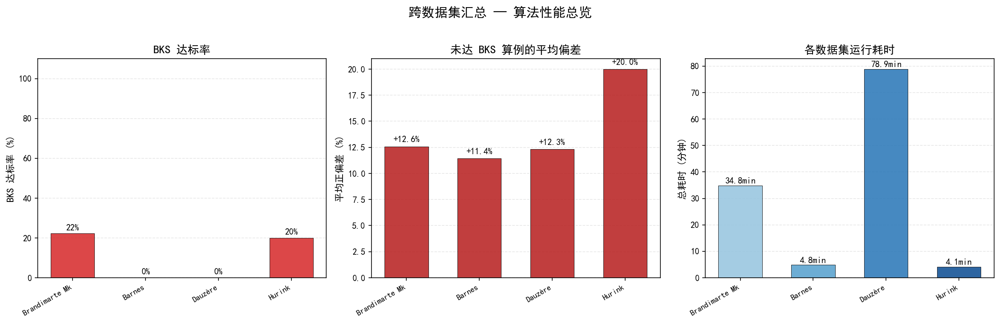
  <br><em>图 1：跨数据集对比总览（左：Cmax 绝对值；右：Gap 百分比与耗时）</em>
</p>

#### 4.3.2 Brandimarte Mk 系列（9 例）

Mk 系列覆盖 10×6 至 20×10 的规模范围，Mk03 和 Mk08 成功达到 BKS。Mk06（10×15，150 道工序）Gap 最大（29.8%），反映了高机器数、高工序数场景下的求解难度。

| 算例 | 规模 | 工序 | BKS | Cmax | Gap | 耗时 |
|------|:----:|:----:|:---:|:----:|:---:|:----:|
| Mk01 | 10×6 | 55 | 40 | 42 | +5.0% | 35s |
| Mk02 | 10×6 | 58 | 26 | 29 | +11.5% | 122s |
| Mk03 | 15×8 | 150 | 204 | 204 | 0% ✅ | 187s |
| Mk04 | 15×8 | 90 | 60 | 68 | +13.3% | 201s |
| Mk05 | 15×4 | 106 | 172 | 177 | +2.9% | 179s |
| Mk06 | 10×15 | 150 | 57 | 74 | +29.8% | 650s |
| Mk07 | 20×5 | 100 | 139 | 149 | +7.2% | 117s |
| Mk08 | 20×10 | 225 | 523 | 523 | 0% ✅ | 206s |
| Mk09 | 20×10 | 240 | 307 | 363 | +18.2% | 394s |

<p align="center">
  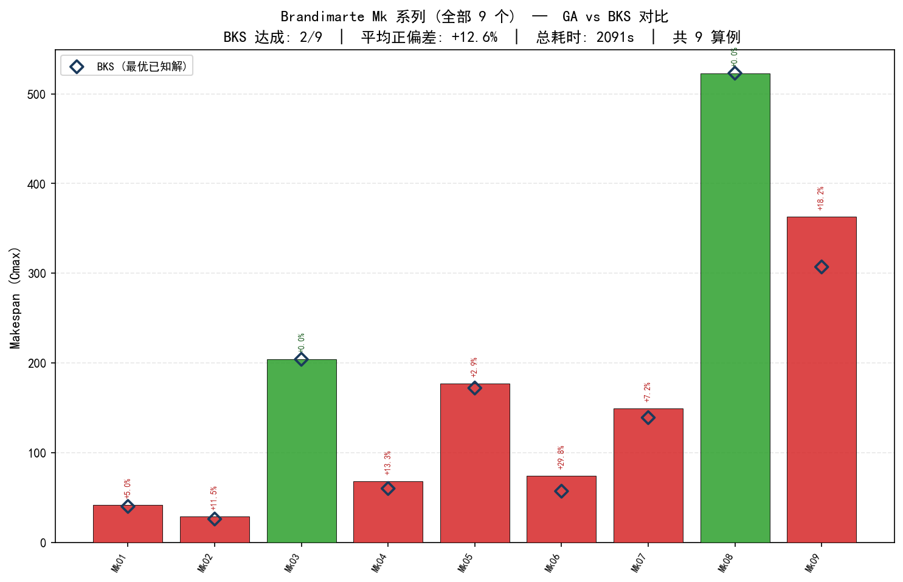
  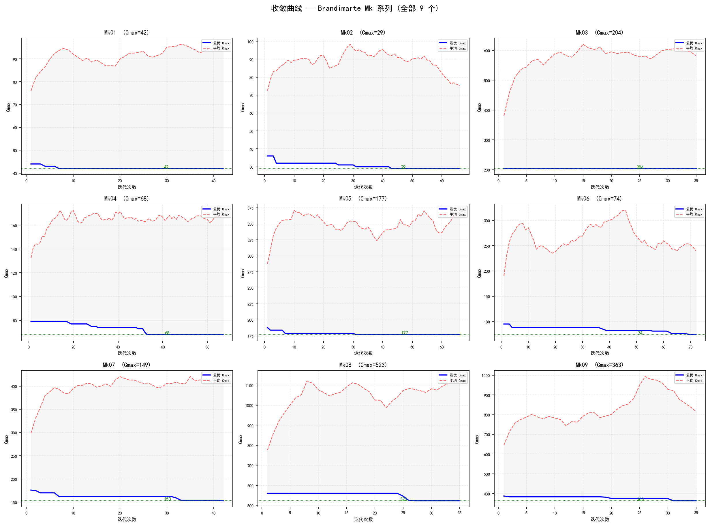
  <br><em>图 2：Brandimarte Mk 族级对比（左）与收敛曲线（右）</em>
</p>

选取两个代表性算例的调度甘特图：Mk03（BKS 命中）与 Mk06（Gap 最大，复杂排产场景）：

<p align="center">
  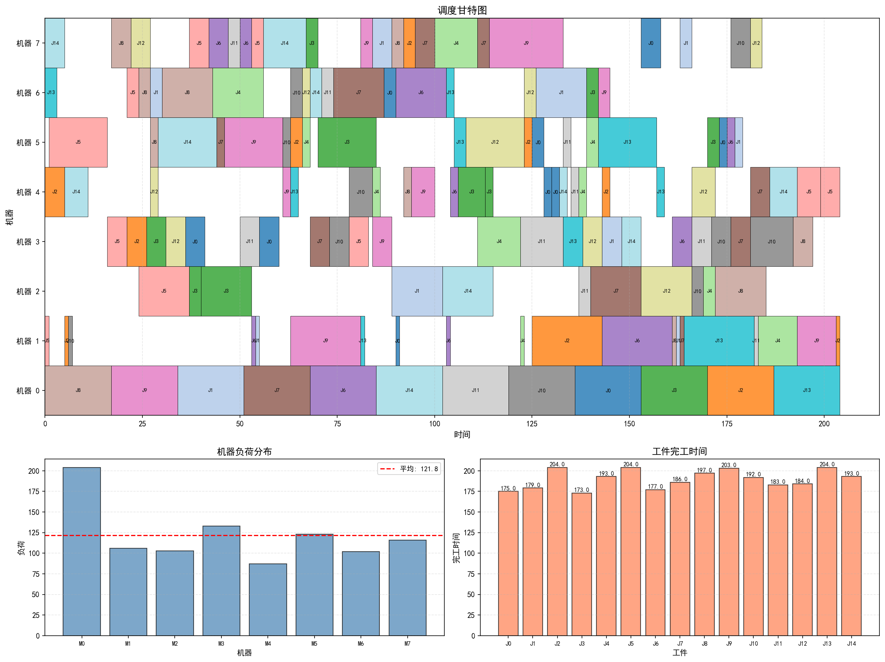
  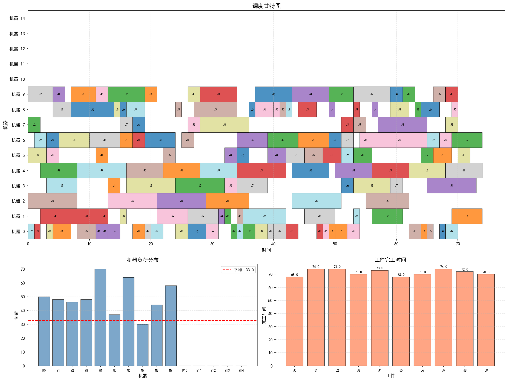
  <br><em>图 3：Mk03（左，BKS=204）与 Mk06（右，Cmax=74，BKS=57）调度分析</em>
</p>

#### 4.3.3 Barnes 系列（mt10 子家族，5 例）

Barnes mt10 子家族均为 10 工件、100 道工序的中等规模算例，机器数 11–13 台。平均 Gap 为 11.4%，mt10xx 偏差最大（17.3%）。

| 算例 | 规模 | 工序 | BKS | Cmax | Gap | 耗时 |
|------|:----:|:----:|:---:|:----:|:---:|:----:|
| mt10c1 | 10×11 | 100 | 927 | 1,010 | +9.0% | 46s |
| mt10cc | 10×12 | 100 | 908 | 1,008 | +11.0% | 44s |
| mt10x | 10×11 | 100 | 918 | 1,002 | +9.2% | 40s |
| mt10xx | 10×12 | 100 | 918 | 1,077 | +17.3% | 51s |
| mt10xxx | 10×13 | 100 | 918 | 1,017 | +10.8% | 110s |

<p align="center">
  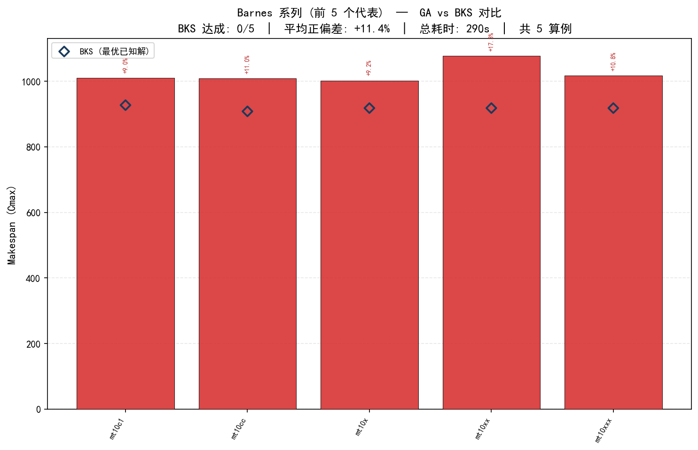
  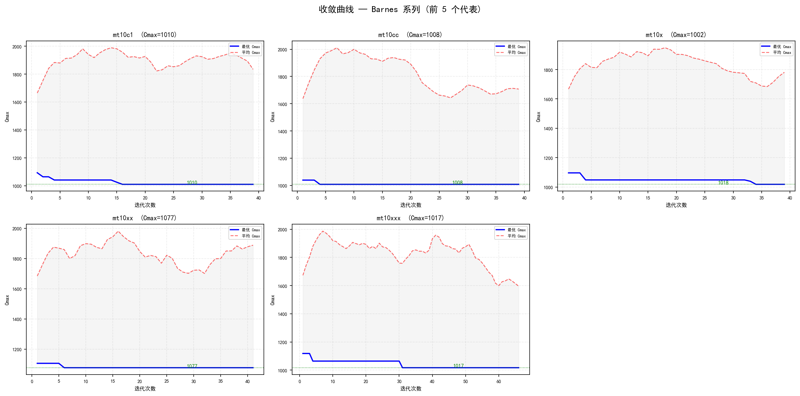
  <br><em>图 4：Barnes mt10 族级对比（左）与收敛曲线（右）</em>
</p>

#### 4.3.4 Dauzère 系列（5 例）

Dauzère 算例是四组中规模最大的（196–293 道工序），08a（15×8, 293 工序）单例耗时 46 分钟。03a 取得最佳相对表现（Gap +2.4%），04a 偏差最大（+27.9%）。

| 算例 | 规模 | 工序 | BKS | Cmax | Gap | 耗时 |
|------|:----:|:----:|:---:|:----:|:---:|:----:|
| 01a | 10×5 | 196 | 2,505 | 2,968 | +18.5% | 129s |
| 02a | 10×5 | 196 | 2,228 | 2,322 | +4.2% | 359s |
| 03a | 10×5 | 196 | 2,228 | 2,282 | +2.4% | 1,335s |
| 04a | 10×5 | 196 | 2,503 | 3,201 | +27.9% | 126s |
| 08a | 15×8 | 293 | 2,061 | 2,237 | +8.5% | 2,783s |

<p align="center">
  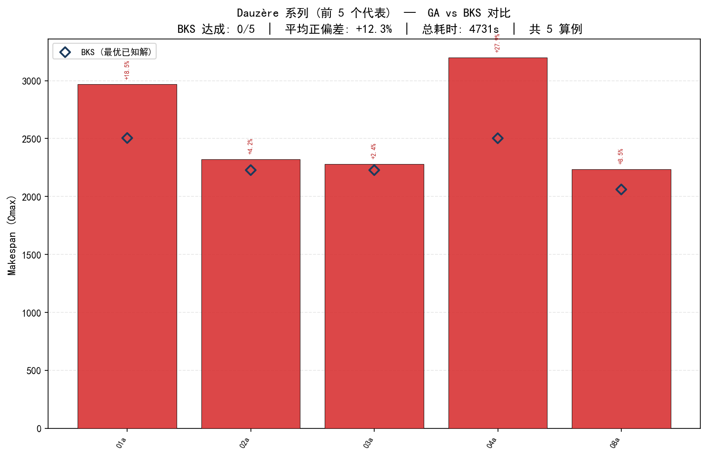
  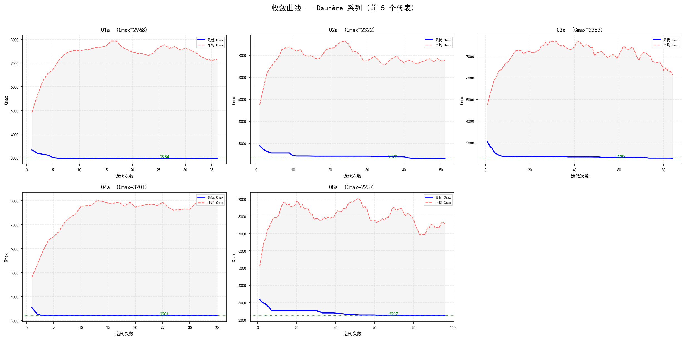
  <br><em>图 5：Dauzère 族级对比（左）与收敛曲线（右）</em>
</p>

Dauzère 03a 的调度分析——该算例在 196 道工序、10×5 配置下取得 +2.4% 的较优表现：

<p align="center">
  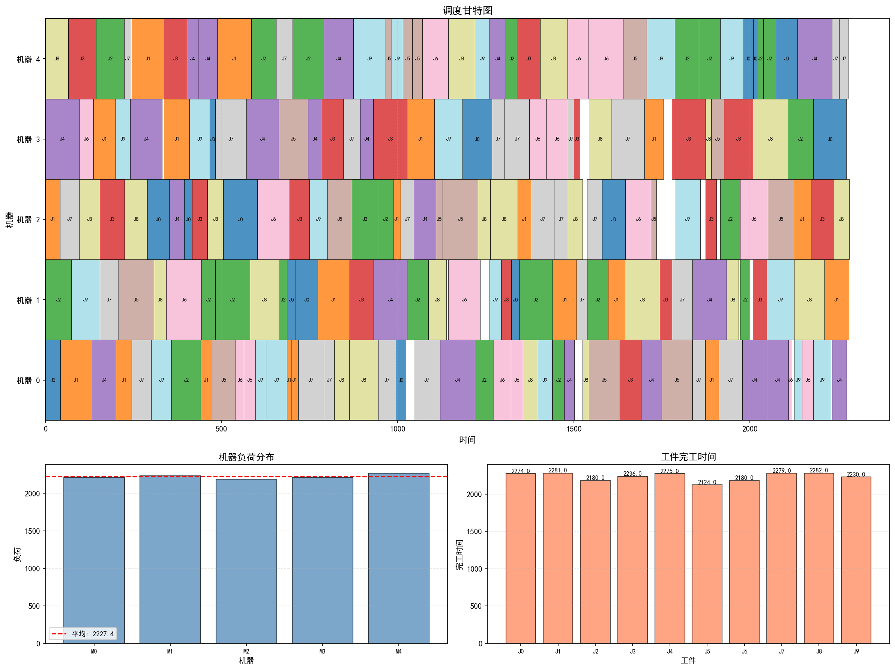
  <br><em>图 6：Dauzère 03a 调度分析（Cmax=2,282，BKS=2,228）</em>
</p>

#### 4.3.5 Hurink 系列（edata 变体，5 例）

Hurink edata 为低柔性配置，mt06_edata 命中 BKS（55）。car1_edata 与 car2_edata 为 11×5 和 13×4 的中等规模算例，Gap 约 20%–24%。

| 算例 | 规模 | 工序 | BKS | Cmax | Gap | 耗时 |
|------|:----:|:----:|:---:|:----:|:---:|:----:|
| car1_edata | 11×5 | 55 | 6,176 | 7,627 | +23.5% | 16s |
| car2_edata | 13×4 | 52 | 6,327 | 7,648 | +20.9% | 46s |
| mt06_edata | 6×6 | 36 | 55 | 55 | 0% ✅ | 7s |
| orb1_edata | 10×10 | 100 | 977 | 1,195 | +22.3% | 83s |
| orb2_edata | 10×10 | 100 | 865 | 980 | +13.3% | 94s |

<p align="center">
  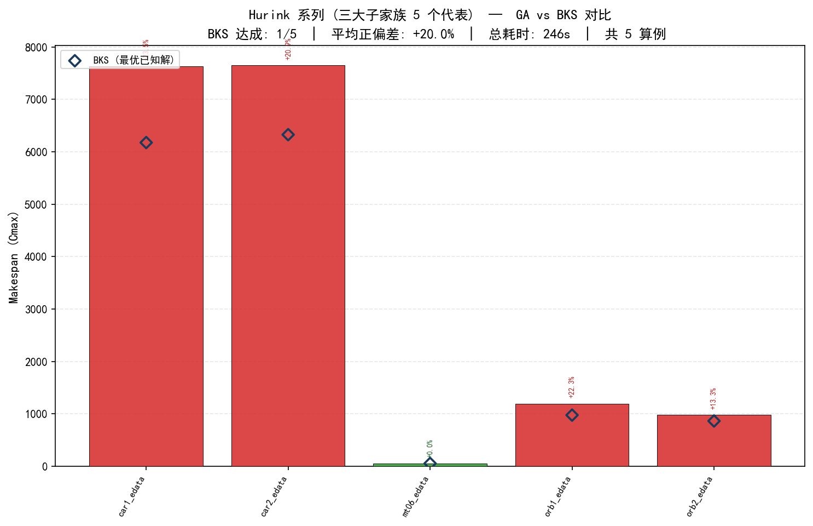
  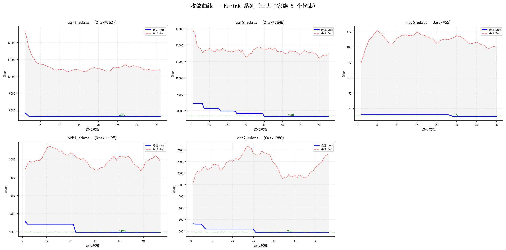
  <br><em>图 7：Hurink edata 族级对比（左）与收敛曲线（右）</em>
</p>

mt06_edata 为规模最小的算例（6×6, 36 工序），算法在 35 代内命中 BKS：

<p align="center">
  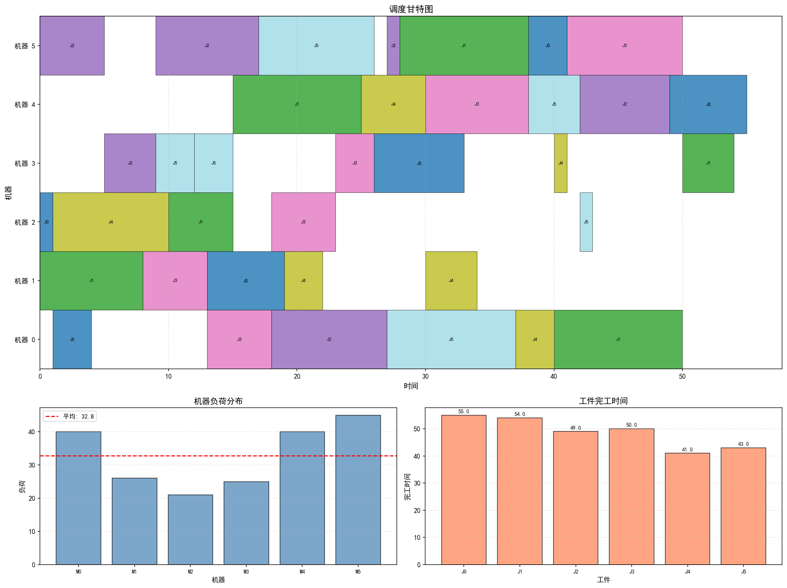
  <br><em>图 8：mt06_edata 调度分析（BKS 命中，Cmax=55）</em>
</p>

#### 4.3.6 收敛性与复杂度分析

全局 Gap 散点图展示了算例规模（工序数）与求解质量的关联——小规模算例（<100 工序）更易命中或接近 BKS，而大规模算例（>180 工序）Gap 分布更分散：

<p align="center">
  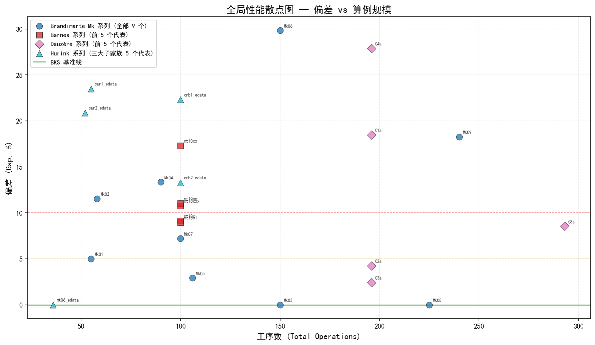
  <br><em>图 9：全局 Gap 散点图（Gap vs 工序数，气泡大小为 Cmax）</em>
</p>

规模-耗时散点图揭示了计算复杂度的非线性特征——150–300 工序区间的算例耗时差异极大（Dauzère 08a 达 46 分钟），主要受工件数 × 机器数 × 工序数的三维组合影响：

<p align="center">
  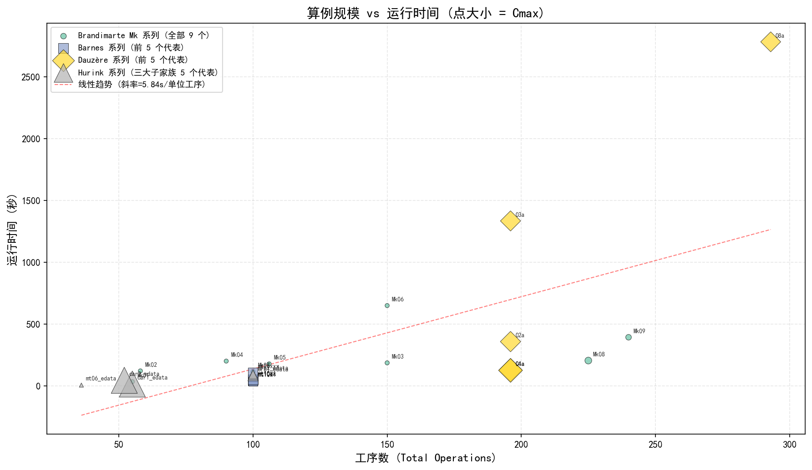
  <br><em>图 10：规模-耗时散点图（工序数 vs 耗时，气泡大小为 Cmax）</em>
</p>

### 4.4 全量实验框架

`run_experiment.py` 提供了面向 24 个代表性算例的全量实验管道：

**四阶段实验设计**

| 批次 | 算例族 | 数量 | 目标 |
|:----:|--------|:----:|------|
| 1 | Brandimarte Mk | 9 | 全覆盖验证 |
| 2 | Barnes（mt10 子家族） | 5 | 中等规模测试 |
| 3 | Dauzère（前 5 例） | 5 | 大规模挑战 |
| 4 | Hurink（edata 变体） | 5 | 高柔性验证 |

**技术特性**

- 分段持久化：每批完成后立即写入 checkpoint JSON 与 CSV，防止数据丢失。
- 断点续跑：通过 `--resume` 参数自动跳过已完成批次。
- 全链路可视化：每批输出族级对比柱状图、收敛曲线子图，最终汇总输出跨族 Gap 散点图、规模-耗时散点图及 24 组甘特图与分析图。

---

## 🚀 5 使用指南

### 5.1 环境配置

**硬件环境**：Intel i5-12490 @ 3.96 GHz, 32 GB DDR4 RAM, Windows 11

**软件依赖**：
```
Python >= 3.7
numpy >= 1.21.0
matplotlib >= 3.4.0
pytest >= 7.0.0
```

### 5.2 安装与运行

```bash
# 安装依赖
pip install numpy matplotlib

# ─── 运行模式 ───

# 单实例运行
python main.py run Mk01                    # Mk 系列
python main.py run barnes mt10c1           # Barnes 系列
python main.py run dauzere 01a             # Dauzère 系列
python main.py run hurink_edata car1       # Hurink 系列

# 批量运行
python main.py batch mk                    # Mk01-Mk09
python main.py batch all                   # 全部 101 个算例

# 滚动时域调度
python main.py rolling_horizon             # 默认 Mk01
python main.py rolling_horizon Mk02        # 指定算例

# 全量实验（24 个代表性算例，分段持久化）
python run_experiment.py                   # 首次运行
python run_experiment.py --resume          # 断点续跑
```

### 5.3 参数配置

所有实验参数集中于 `config.py`，涵盖 GA、RL、ALNS、TS、RHC 五大模块。关键参数包括：

- GA：种群规模（400）、最大代数（100）、交叉/变异概率边界
- RL：Q-学习率（0.15）、折扣因子（0.85）、探索率衰减参数
- ALNS：权重衰减系数（0.40）、SA 初始温度（120）、退火速率（0.88）
- TS：最大迭代次数（80）、禁忌步长（15）
- RHC：退化系数（1.0 即禁用）、时间波动幅度（0.10）、触发方式
- 早停策略：停滞代数上限（35）、多样性阈值（0.03）

---

## 📝 6 结论与展望

本文提出了一种融合 GA、Q-学习 RL、ALNS 与 TS 的四阶段混合优化算法 GA–RL–ALNS–TS，并集成 RHC 机制，用于求解静态与动态场景下的 FJSP。算法在 101 个标准基准算例上完成了系统验证，覆盖了从轻量级到大规模、从低柔性到高柔性的广泛问题配置。实验结果表明，该混合框架能够有效利用各算法的互补优势，在多目标优化中取得竞争力表现。

**未来工作方向**：

1. **多目标扩展**：将当前以 Makespan 为核心的优化目标扩展为 Pareto 多目标优化，纳入能耗、成本等绿色制造指标。
2. **深度强化学习**：探索 DQN、PPO 等深度强化学习方法替代当前 Q-表格，提升对大规模状态空间的处理能力。
3. **真实车间数据验证**：引入实际生产数据进行验证，评估算法在真实扰动环境中的鲁棒性与迁移能力。
4. **并行计算加速**：基于多核 CPU 或 GPU 实现种群评估与 TS 搜索的并行化，降低大规模实例的计算时间。

---

## 📚 参考文献

[1] Garey M R, Johnson D S, Sethi R. The complexity of flowshop and jobshop scheduling[J]. *Mathematics of Operations Research*, 1976, 1(2): 117-129.

[2] Brucker P, Schlie R. Job-shop scheduling with multi-purpose machines[J]. *Computing*, 1990, 45(4): 369-375.

[3] Carlier J, Pinson E. An algorithm for solving the job-shop problem[J]. *Management Science*, 1989, 35(2): 164-176.

[4] Panwalkar S S, Iskander W. A survey of scheduling rules[J]. *Operations Research*, 1977, 25(1): 45-61.

[5] Ouelhadj D, Petrovic S. A survey of dynamic scheduling in manufacturing systems[J]. *Journal of Scheduling*, 2009, 12(4): 417-431.

[6] Li X, Gao L. An effective hybrid genetic algorithm and tabu search for flexible job shop scheduling problem[J]. *International Journal of Production Economics*, 2016, 174: 93-110.

[7] Brandimarte P. Routing and scheduling in a flexible job shop by tabu search[J]. *Annals of Operations Research*, 1993, 41(3): 157-183.

[8] Ropke S, Pisinger D. An adaptive large neighborhood search heuristic for the pickup and delivery problem with time windows[J]. *Transportation Science*, 2006, 40(4): 455-472.

[9] Sutton R S, Barto A G. *Reinforcement learning: An introduction*[M]. MIT Press, 2018.

[10] Hurink J, Jurisch B, Thole M. Tabu search for the job-shop scheduling problem with multi-purpose machines[J]. *Operations-Research-Spektrum*, 1994, 15(4): 205-215.

---

<p align="center">
  <strong>版本 1.6.0</strong> &nbsp;|&nbsp; 最后更新: 2026-06-14 &nbsp;|&nbsp; MIT License
</p>
